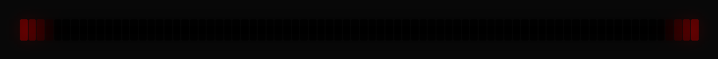
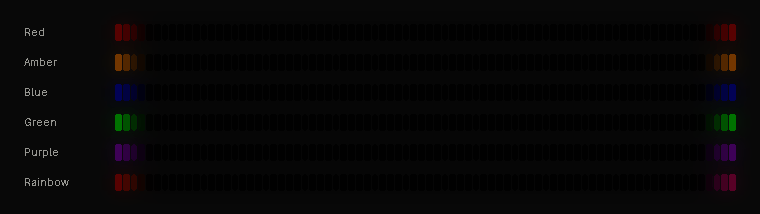

# KITT scanner + SOCD for the Weikav Nut65

A custom QMK firmware for the **Weikav / LEKU Nut65** (65%, tri-mode). It turns the keyboard's front light bar into a **KITT scanner**, in both the 2008 KI3000 style and the original 1982 style, and can carry the scanner across the keys. It also adds **SOCD** (last-input priority on A/D) and a one-key **game mode** for gaming. It runs on **[Vial](https://get.vial.today/)**, so you can remap keys and set up tap dance, combos, key overrides and macros live, without reflashing. Wired, Bluetooth and 2.4 GHz all still work.

**[Download the latest release](https://github.com/MoonZhe/Nut65/releases/latest)**, then see [Flashing](#flashing).




<sub>2008 (top) and the original 1982 scanner (bottom), rendered from the firmware's own animation code, frame for frame. On the keyboard they follow the light-bar brightness keys.</sub>

## The scanners

### 2008 (KI3000)
The 2008 scanner **floods and drains in both directions**. Its timing was measured frame by frame from a [KI3000 scanner replica](https://www.youtube.com/watch?v=Lz5OhpBDkkE) and rebuilt on the keyboard's 80-LED bar:

1. **Flood in:** light pours in from both ends and meets in the middle.
2. **Drain to the middle:** the ends go dark first, and the light collapses into the centre.
3. **Flood out:** light pours back out from the centre to the ends.
4. **Drain to the ends:** a dark gap opens in the middle and spreads outward.

Each phase starts 300 ms before the previous one finishes, so the movement never stops. Every moving edge has an 8-LED soft fade. The bar is drawn per LED, so everything meets at the true centre; that matters because the board groups the bar into 15 uneven segments. It comes in **red, amber, blue, green, purple and rainbow**, with **5 speeds**:



### 1982 (the original)


The original is **eight red lamps** with one light sweeping back and forth. It was modelled on footage of the TV car:

- The light lingers briefly at each end, and a full left-right-left cycle on the car takes about **1.8 s**.
- Each lamp comes on fully as the light reaches it, then cools like an incandescent bulb. That leaves **4–5 lamps glowing at once** at about 100/80/60/40/20 %, and near the ends the trail wraps around as the light turns.

On the bar it's drawn as 8 segments of 10 LEDs. The default speed is one step slower than the car, at 1.19 s per sweep; the KITT speed keys adjust it.

Both scanners play once as a **boot animation** at power-on, across the light bar and the keys together, in your KITT colour.

## Lighting

### Custom key effects
Four key effects tie the keys to the light bar. They come at the end of the **Fn + \** cycle:

| Effect | What it does |
| --- | --- |
| **KITT Sweep** | The 2008 scanner across the keys, in step with the bar: same clock, speed and colour. |
| **KITT 1982** | The 1982 scanner across the keys. Each key takes the lamp above it. |
| **KITT Reactive** | Keys stay dark. Each keypress sends a soft streak along its row in the scanner's colour, and the effect speed sets how fast it travels. |
| **Bar Echo** | Each key shows whatever the light bar shows above it: solid colour, KITT, the WPM meter, even music mode. |

### All key effects

| Build | Fn + \ cycles through | Vial's Lighting tab offers |
| --- | --- | --- |
| **Vial** (`leku_nut65_vial.bin`) | Cycle Left Right, Cycle Up Down, Rainbow Moving Chevron, Cycle Out In, Cycle Out In Dual, Cycle Pinwheel, Cycle Spiral, Dual Beacon, Rainbow Beacon, Rainbow Pinwheels, Raindrops, Jellybean Raindrops, Pixel Flow, Digital Rain, Solid Reactive Simple, Solid Reactive Cross, Splash, Alphas Mods, Gradient Left Right, Breathing, Band Sat, Band Val, Band Pinwheel Val, Band Spiral Val, Cycle All, then **KITT Sweep, KITT 1982, KITT Reactive, Bar Echo** | All 44 QMK effects built in (below), plus **Direct Control** (see [Vial](#vial)) |
| **Personal** (`leku_nut65_vial_personal.bin`) | Solid Reactive Simple, **KITT Reactive, KITT Sweep, KITT 1982, Bar Echo**, Solid Color, Breathing, Typing Heatmap | Solid Color, Breathing, Typing Heatmap, Solid Reactive Simple, Direct Control |
| **VIA** (`leku_nut65_socd.bin`) | The same as the Vial build | VIA's lighting menu |

The 44 QMK effects in the Vial build: Solid Color, Alphas Mods, Gradient Up Down, Gradient Left Right, Breathing, Band Sat, Band Val, Band Pinwheel Sat, Band Pinwheel Val, Band Spiral Sat, Band Spiral Val, Cycle All, Cycle Left Right, Cycle Up Down, Rainbow Moving Chevron, Cycle Out In, Cycle Out In Dual, Cycle Pinwheel, Cycle Spiral, Dual Beacon, Rainbow Beacon, Rainbow Pinwheels, Raindrops, Jellybean Raindrops, Hue Breathing, Hue Pendulum, Hue Wave, Pixel Rain, Pixel Flow, Pixel Fractal, Typing Heatmap, Digital Rain, Solid Reactive Simple, Solid Reactive, Solid Reactive Wide, Solid Reactive Multiwide, Solid Reactive Cross, Solid Reactive Multicross, Solid Reactive Nexus, Solid Reactive Multinexus, Splash, Multisplash, Solid Splash, Solid Multisplash.

The default after a factory reset is **Solid Reactive Simple** in red: keys stay dark and light up when pressed. Vial's Lighting tab can't select the custom effects, so use Fn + \ for those. **Fn + Enter** steps the key colour, **Fn + ↑ / ↓** set key brightness, and **Fn + ← / →** set effect speed. KITT Reactive's streak speed is the effect speed.

### Light-bar modes (Fn + Insert)

| Build | Fn + Insert steps through |
| --- | --- |
| **Vial** and **VIA** | Rainbow flowing right, rainbow flowing left, rainbow flowing into the centre, colour-cycle breathing (8 colours), solid red, orange, yellow, green, cyan, blue, purple, white, **KITT 2008** red, amber, blue, green, purple, rainbow, **KITT 1982**, **typing-speed meter**, off |
| **Personal** | Solid red, orange, yellow, green, cyan, blue, purple, white, **KITT 2008** red, amber, blue, green, purple, rainbow, **KITT 1982**, **typing-speed meter**, off |

**Fn + Delete** (music mode) hands the light bar to the board's built-in music-reactive light controller. Press it again for the controller's next pattern, and press Fn + Insert to come back to the cycle. Fn + PgUp / PgDn set the light-bar brightness. The KITT modes and the meter follow it.

## Controls

| Keys | What it does |
| --- | --- |
| **Fn + Insert** | Cycles the light bar (see [Lighting](#lighting)). Remembered. |
| **Fn + \** | Cycles the key effects (see [Lighting](#lighting)). |
| **Fn + ,** / **Fn + .** | KITT slower / faster (both scanners). The key blinks white for each step and red ×3 at the slowest or fastest speed. Remembered. |
| **Fn + PgUp / PgDn** | Light-bar brightness. The scanners follow it. |
| **Fn + G** | SOCD on A/D on or off. A and D flash green (on) or red (off). Remembered. |
| **Fn + Left Win** | Game mode on or off. Left Win acts as Fn, Right Alt acts as Win, SOCD turns on, and the Left Win key glows red. Exit with Right Fn + Left Win. Remembered. |
| **Fn + D** (hold 3 s) | Debounce: 1 ms low latency (D blinks red) or 8 ms (D blinks white, the default). Remembered. |
| **Fn + Right Shift + Esc** | Bootloader (DFU), for flashing. Settings are kept. |
| **Fn + Right Shift + Backspace** (hold 3 s) | Factory reset: back to the layout compiled into the firmware, and the default lighting (red Solid Reactive Simple keys, red KITT scanner). |
| **Esc + Enter** (hold) | Vial unlock, when Vial asks for it. |

### SOCD
SOCD (simultaneous opposing cardinal directions) handling with last-input priority on **A** and **D**: pressing D while A is held releases A, and letting go of D re-presses A if it's still held. Turn it off for **CS2 on Valve servers**, which kick players for hardware SOCD.

### Typing-speed meter
A light-bar mode in the Fn + Insert cycle. The bar fills outwards from the middle as your typing speed rises, from green through yellow to red, and is full at 120 WPM (`WPM_FULL`). A white marker holds your peak for 1.5 s, then falls back. The centre glows faintly while you're idle.

### Game mode
A single toggle for gaming, with no duplicate layers:
- **Left Win acts as Fn**, so Win + 1 gives F1 and the Windows key can't knock you out of a game.
- **Right Alt acts as Win** for when you do need it.
- **SOCD turns on.** It goes back to its previous setting when you leave game mode, and Fn + G still toggles it inside game mode.
- **The Left Win key glows red** while game mode is on.

## Firmware

Download from **[Releases](https://github.com/MoonZhe/Nut65/releases/latest)**. The same files are in `firmware/`, and `SHA256SUMS.txt` on the release lets you check a download.

| File | What |
| --- | --- |
| `firmware/vial/leku_nut65_vial.bin` | **Recommended.** Vial, every lighting effect, everything above. |
| `firmware/personal/leku_nut65_vial_personal.bin` | My own build: the same, with trimmed lighting. Keys: Solid Reactive Simple, KITT Reactive, KITT Sweep, KITT 1982, Bar Echo, Solid Color, Breathing, Typing Heatmap. Bar: solid colours, KITT, WPM, off. |
| `firmware/leku_nut65_socd.bin` | VIA build on the OEM source, the earlier version of this project. It has the light-bar scanners, the custom key effects, SOCD and game mode, but not Vial. |
| `firmware/leku_nut65_default.bin` | Unmodified OEM source, to go back to stock. |

## Flashing

> Flashing custom firmware is at your own risk and may void your warranty. The Nut65's WB32 bootloader can't be overwritten by a flash, so a bad flash is recoverable: re-flash, or go back with `firmware/leku_nut65_default.bin`.

1. Plug in USB and switch to wired mode (**Fn + T**). Close Vial, VIA and the Weikav web driver.
2. If Windows doesn't recognise the bootloader, install the WB32 DFU driver from [WestberryTech/wb32-dfu-updater](https://github.com/WestberryTech/wb32-dfu-updater).
3. Enter DFU with **Fn + Right Shift + Esc**. The keyboard goes dark and shows up as `342D:DFA0`.
4. Flash the file you downloaded from [Releases](https://github.com/MoonZhe/Nut65/releases/latest). `wb32-dfu-updater_cli` comes with [QMK MSYS](https://msys.qmk.fm/):
   ```
   wb32-dfu-updater_cli -t -s 0x08000000 -D firmware/vial/leku_nut65_vial.bin
   wb32-dfu-updater_cli -R
   ```
5. The first flash over the stock firmware, or over an older build of this one, resets all settings. The keyboard then boots into the layout compiled into the firmware. **That layout is mine** (see `nut65.layout.json`). After that, flashing keeps your Vial layout, macros, tap dances, combos and lighting. Hold **Fn + Right Shift + Backspace** for 3 s to go back to the compiled layout.

## Vial
Open [Vial](https://get.vial.today/) (or [vial.rocks](https://vial.rocks/) in Chrome). It works over USB and 2.4 GHz. The new keys show up by name: SOCD toggle, Knight Rider slower and faster, and Game mode.

**Direct Control** in the Lighting tab hands the key LEDs to PC software such as OpenRGB or SignalRGB. Vial itself doesn't drive them in that mode, so the keys stay dark. The light bar stays under the keyboard's control.

## Building from source

### Vial build
Uses [vial-qmk](https://github.com/vial-kb/vial-qmk) and [QMK MSYS](https://msys.qmk.fm/). The board's OEM code is ported in `vial/`:

```
git clone https://github.com/vial-kb/vial-qmk.git
cd vial-qmk
git checkout dd43959a            # vial-qmk this was built and tested against
git submodule update --init --recursive --depth 1
cp -r ../Nut65/vial/keyboards/* keyboards/
git apply ../Nut65/patches/vial-qmk-pixel-fractal-no-led.patch ../Nut65/patches/vial-qmk-reactive-offset-clamp.patch
python ../Nut65/tools/sync_vial_keymap.py keyboards/leku/nut65
bash ../Nut65/tools/build_vial.sh            # builds vial and vial_personal into .build/
```

`sync_vial_keymap.py` generates both Vial keymaps from the shared source in `keymap/socd`. `build_vial.sh` calls QMK's inner makefile directly so that `-j` reaches the compiler, which makes it several times faster on Windows.

### VIA build (OEM source)
```
git clone https://github.com/hangshengkeji/qmk_firmware.git
cd qmk_firmware
git checkout 3164abd3            # OEM tree this was built and tested against
git submodule update --init --depth 1 lib/chibios lib/chibios-contrib lib/printf lib/lufa lib/vusb
git apply ../Nut65/patches/nut65-indicators-user-hook.patch
cp -r ../Nut65/keymap/socd keyboards/leku/nut65/keymaps/
make leku/nut65:socd
```

### Your own layout and tuning
To use your own layout as the default, export it from VIA or Vial and regenerate the layers:

```
python tools/gen_layers.py your.layout.json <qmk>/keyboards/leku/nut65/keyboard.json > keymap/socd/layers.inc
```

To tune the scanners, edit `keymap/socd/keymap.c`:

| Setting | What it changes |
| --- | --- |
| `KITT_FLOOD_MS` / `KITT_DRAIN_MS` | 2008 phase lengths |
| `KITT_TRANSITION_MS` | 2008 overlap between phases (negative) or a pause (positive) |
| `KITT_SOFT` | 2008 edge softness |
| `K82_PASS_MS` / `K82_COOL_MS` | 1982 sweep time and how long a lamp takes to cool |
| `kitt_speed_pct` | Speed levels (both) |
| `kitt_hues` | 2008 colours |

Afterwards, `python tools/render_preview.py` re-renders the GIFs above from the same maths.

### What's in here

| Path | What |
| --- | --- |
| `firmware/` | Ready-to-flash builds (see above) |
| `keymap/socd/` | Keymap source shared by the Vial and VIA builds: SOCD, game mode, the scanners, the key effects (`rgb_matrix_user.inc`), the boot animation and the layout |
| `vial/` | The Nut65 board and its wireless stack, ported to vial-qmk |
| `patches/` | `nut65-indicators-user-hook.patch` for the OEM tree; two QMK bug fixes for vial-qmk; the wake-debug log |
| `via/` | Key definitions (VIA design file, also used to generate `vial.json`), plus the matching layout |
| `tools/` | Vial keymap generator and build script, layout generator, GIF renderer, a VIA probe, and `wake_log.py` |

### How it hooks in
- The board already owns `process_record_user`, so the keymap uses `pre_process_record_user`.
- The board's `rgb_matrix_indicators_advanced_kb` ends by calling `rgb_matrix_indicators_advanced_user`, so the light-bar modes are drawn last.
- The KITT and WPM modes slot into the stock Fn+Insert cycle. While one is showing, the board stays in its white mode underneath, so the brightness keys keep working.
- Game mode is a flag, not a layer: in `pre_process_record_user`, Left Win switches the Fn layer on and off, and Right Alt sends Right Win.
- Settings live in a few bytes added to the end of the board's user EEPROM block.
- Vial stamps its saved data with a random ID per build and normally wipes it on every flash. `via_init_kb` re-stamps data that was valid under a previous build, as long as a layout-version byte (`VIAL_PERSIST_VERSION`) still matches.

## Bugs fixed along the way
- **Every flash reset all settings.** The OEM code for Fn + Right Shift + Esc called `eeconfig_disable()` before jumping to the bootloader, so the next boot did a full factory reset. That call is gone.
- **Wake from sleep.** On 2.4 GHz, the first keypress after sleep would sometimes register but only flash the lights. The OEM wireless code has two 5-minute sleep timers. When the second one fired while the keyboard was already falling asleep, its sleep request was left pending and sent the keyboard straight back to sleep after the next wake. `suspend_wakeup_init_user` now clears any leftover request on wake. It was found with a temporary event log, which is still here: apply `patches/debug-wake-logging.patch` to the OEM tree, build with `WAKE_DEBUG=yes`, and read it with `python tools/wake_log.py --elf <build>.elf`.
- **Fn + D did nothing.** The OEM debounce patch used the fixed 8 ms in both branches, and the saved setting flipped meaning on every boot. The Vial build uses its own debounce (`hs_debounce.c`), so 1 ms really is 1 ms.
- **Solid Reactive lit every key.** Newer QMK compiles its colour maths with `FASTLED_SCALE8_FIXED`, which lets the reactive effects' fade overflow past 255 and wrap back to full brightness. Fixed in `patches/vial-qmk-reactive-offset-clamp.patch`; current upstream QMK still has the bug.
- **Pixel Fractal froze the keyboard.** It wrote to LED `NO_LED` (255) for matrix positions without a key, past the end of the LED buffer. Upstream QMK has since fixed this, and the fix is backported in `patches/vial-qmk-pixel-fractal-no-led.patch`.
- **Raw HID overflow.** A light-recording command trusted a size from the host and could write past the 32-byte HID packet. It's now clamped.
- **Wireless receive overflow.** The radio-module parser trusted a frame's length byte and could write past its 36-byte buffer. Raw HID arrives over 2.4 GHz and Bluetooth through this parser. Oversized frames are now dropped.
- **Factory reset over USB without unlocking.** The board answered VIA's EEPROM-reset command itself, ahead of Vial's lock. In the Vial build it now needs Vial unlocked (Esc + Enter). The Fn + Right Shift + Backspace key is unaffected.

## Credits
- Weikav / [hangshengkeji](https://github.com/hangshengkeji/qmk_firmware) for publishing the Nut65 QMK source.
- [Vial](https://get.vial.today/) and [vial-qmk](https://github.com/vial-kb/vial-qmk).
- [Pascal Getreuer's SOCD Cleaner](https://getreuer.info/posts/keyboards/socd-cleaner/index.html), the basis of the SOCD logic.
- [Knight Research](https://www.youtube.com/watch?v=Lz5OhpBDkkE) for the KI3000 scanner replica the 2008 animation was measured from.
- [bhctsntrk/nut65-signalrgb](https://github.com/bhctsntrk/nut65-signalrgb) for documenting Nut65 flashing and recovery.

## License
GPL-2.0-or-later, the same as QMK. See [LICENSE](LICENSE).

<sub>A fan project. Not affiliated with or endorsed by Weikav or the owners of Knight Rider. KITT and Knight Rider belong to their respective owners.</sub>
